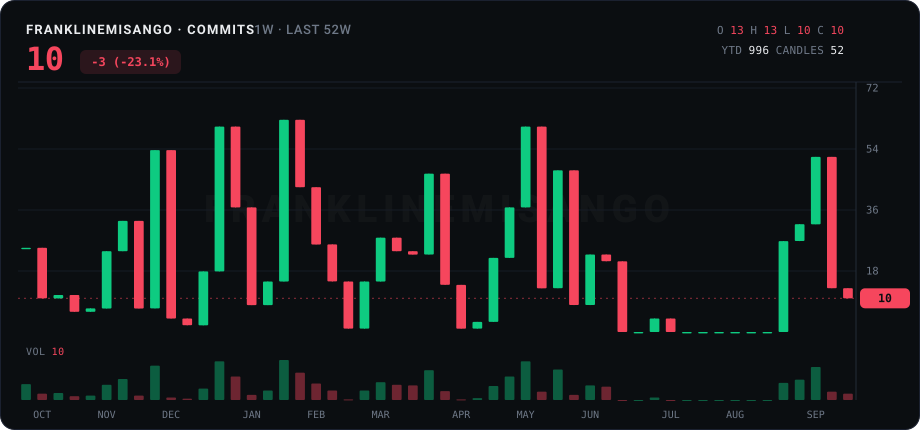
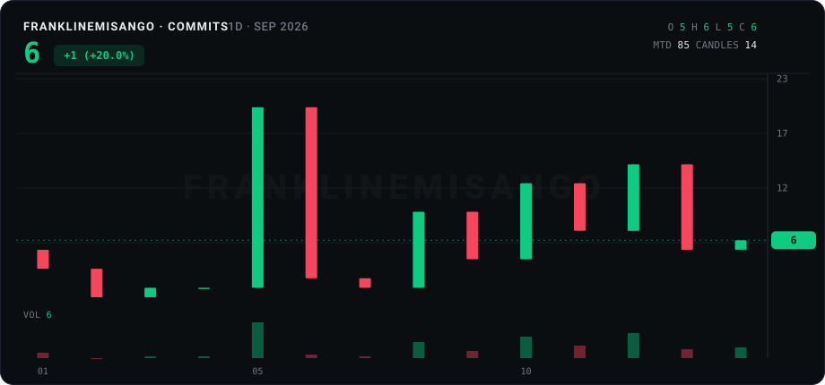

  

## 𝗠𝘆 𝗧𝗲𝗰𝗵 𝗦𝘁𝗮𝗰𝗸

  
  
  
  
  
  
  
  
  
  
  
  
  
  
  
  
  
  
  
  
  

## 𝗣𝘂𝗯𝗹𝗶𝗰 𝗣𝗿𝗼𝗳𝗶𝗹𝗲
<table>
  <tr>
    <td align="center" width="33%">
      <picture>
        <source media="(prefers-color-scheme: dark)" srcset="https://leetcard.jacoblin.cool/FranklineMisango?theme=dark&font=Zen%20Loop">
        <source media="(prefers-color-scheme: light)" srcset="https://leetcard.jacoblin.cool/FranklineMisango?theme=light&font=Zen%20Loop">
        
      </picture>
    </td>
    <td align="center" width="33%">
      <picture>
        <source media="(prefers-color-scheme: dark)" srcset="https://github-stackoverflow-readme.vercel.app/?userId=17990967&theme=dark">
        <source media="(prefers-color-scheme: light)" srcset="https://github-stackoverflow-readme.vercel.app/?userId=17990967&theme=light">
        
      </picture>
    </td>
    <td align="center" width="33%">
      <picture>
        <source media="(prefers-color-scheme: dark)" srcset="https://hackerrank-stats-card.netlify.app/api/hackerrank-card?username=franklinemisang1&theme=dark">
        <source media="(prefers-color-scheme: light)" srcset="https://hackerrank-stats-card.netlify.app/api/hackerrank-card?username=franklinemisang1&theme=light">
        
      </picture>
    </td>
  </tr>
</table>

## 𝗢𝗽𝗲𝗻 𝘀𝗼𝘂𝗿𝗰𝗲

## 𝗦𝘁𝗮𝘁𝘀

## 𝗩𝗶𝗯𝗲

